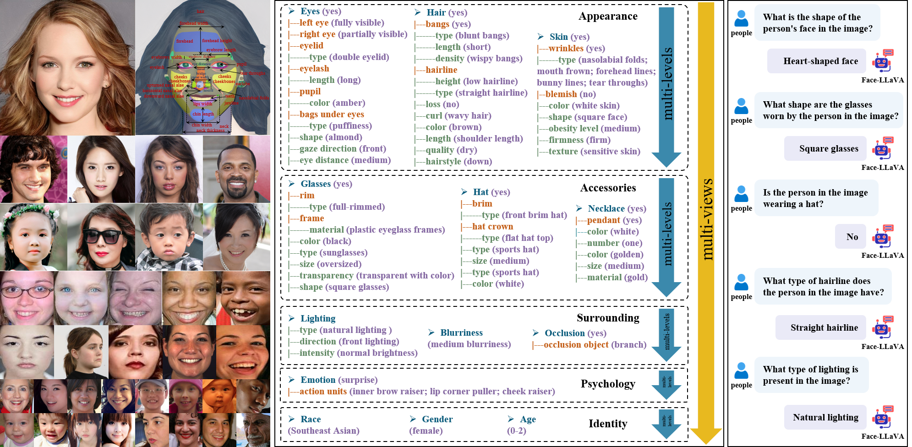
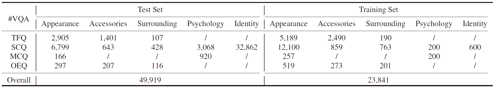
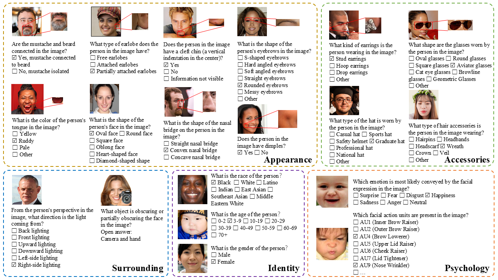
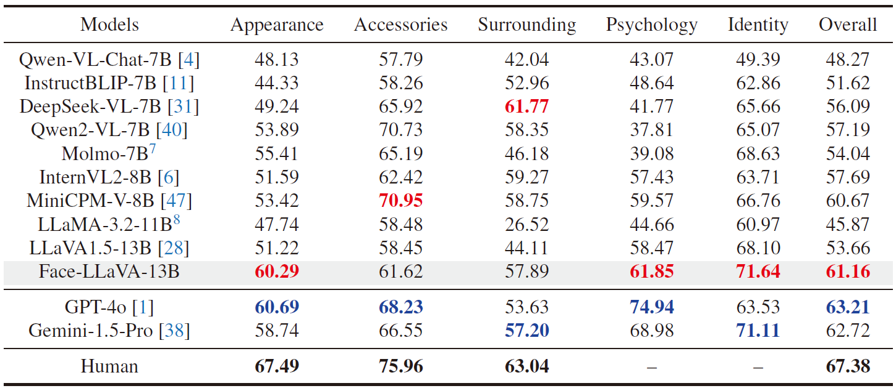
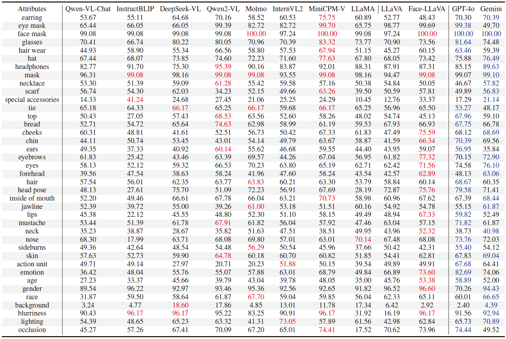

<div align="center">  
<h2>FaceBench: A Multi-View Multi-Level Facial Attribute VQA Dataset for Benchmarking Face Perception MLLMs [CVPR 2025]</h2>
Xiaoqin Wang, Xusen Ma, Xianxu Hou, Meidan Ding, Yudong Li, Junliang Chen, Wenting Chen, Xiaoyang Peng, Linlin Shen*

[](https://arxiv.org/pdf/2503.21457)
[](https://github.com/CVI-SZU/FaceBench/tree/main)
[](https://github.com/CVI-SZU/FaceBench/tree/main)
[](https://huggingface.co/wxqlab/face-llava-v1.5-13b)  
</div>

## Overview
In this work, we introduce **FaceBench**, a dataset featuring hierarchical multi-view and multi-level attributes specifically designed to assess the comprehensive face perception abilities of MLLMs. We construct a hierarchical facial attribute structure, which encompasses five views with up to three levels of attributes, totaling over **210** attributes and **700** attribute values. Based on the structure, the proposed FaceBench consists of **49,919 visual question-answering (VQA) pairs** for evaluation and **23,841 pairs for fine-tuning**. Moreover, we further develop a robust face perception MLLM baseline, **Face-LLaVA**, by training with our proposed face VQA data.
<div align="center"></div>

## News
* **[2024-08-20]** The Face-LLaVA model is released on [HuggingFace](https://huggingface.co/wxqlab/face-llava-v1.5-13b)🤗.
* **[2024-03-27]** The paper is released on [ArXiv](https://arxiv.org/pdf/2503.21457)🔥.

## TODO
- [X] Release the Face-LLaVA model.
- [ ] Release the evaluation code.
- [ ] Release the dataset.

## Dataset Statistics
**Distribution of visual question-answer pairs.**
<div align="center"></div>

**Some samples from our dataset.**
<div align="center"></div>

## Evaluation

## Results
**Experimental results of various MLLMs and our Face-LLaVA across five facial attribute views.**
<div align="center"></div>

**Experimental results of various MLLMs and our Face-LLaVA across Level 1 facial attributes.**
<div align="center"></div>

## Citation
If you find this work useful for your research, please consider citing our paper:
```
@inproceedings{wang2025facebench,
  title={FaceBench: A Multi-View Multi-Level Facial Attribute VQA Dataset for Benchmarking Face Perception MLLMs},
  author={Wang, Xiaoqin and Ma, Xusen and Hou, Xianxu and Ding, Meidan and Li, Yudong and Chen, Junliang and Chen, Wenting and Peng, Xiaoyang and Shen, Linlin},
  booktitle={Proceedings-2025 IEEE/CVF Conference on Computer Vision and Pattern Recognition, CVPR 2025},
  year={2025}
}

@article{wang2025facebench,
  title={FaceBench: A Multi-View Multi-Level Facial Attribute VQA Dataset for Benchmarking Face Perception MLLMs},
  author={Wang, Xiaoqin and Ma, Xusen and Hou, Xianxu and Ding, Meidan and Li, Yudong and Chen, Junliang and Chen, Wenting and Peng, Xiaoyang and Shen, Linlin},
  journal={arXiv preprint arXiv:2503.21457},
  year={2025}
}
```
If you have any questions, you can either create issues or contact me by email wangxiaoqin2022@email.szu.edu.cn.

## Acknowledgments
This work is heavily based on [LLaVA](https://github.com/haotian-liu/LLaVA). Thanks to the authors for their great work.
